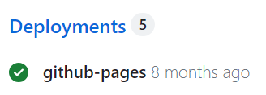
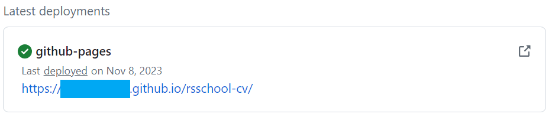

# CV. Markdown & Git

Your task is to create a repository according to the requirements, add your CV in markdown format to it, and deploy the CV in markdown format to GitHub Pages.
## CV Contents:

### EPAM HR Department Recommendations

1. Full Name
2. Contact Information
3. Brief Self-Introduction (your goals and priorities, emphasize your strengths, describe your work experience if applicable, or your desire to learn and acquire new skills)
4. Skills (programming languages, frameworks, methodologies, version control systems, and development tools you are proficient in)
5. Code Examples
6. Work Experience (Junior Devs can list educational projects with the skills used and links to the source code)
7. Education (including completed courses and training)
8. English Language (your English proficiency level, and if you had language practice, describe it)

## CV Writing Recommendations:

- CV design is up to you. Strive to make it of high quality. You can refer to the examples provided in the task materials for CV design inspiration.
- The CV should be in English.
- It is recommended to include real data in the CV.
- Add your photo or avatar to the CV. A photo is preferable.
- Specify up-to-date contact information, including your Discord server nickname.
- As a code example, provide a solution to a problem from [Codewars](https://www.codewars.com/).
- Add code using symbols and tags, not images.
- For completed projects, include the project's name, a link to the project's code on GitHub, or a link to the project's page. If you haven't completed any projects yet, use this CV as your first project.

## Technical Requirements:

- The work will be evaluated in the latest version of Google Chrome.
- There are no restrictions on using JavaScript libraries, preprocessors, frameworks, or any well-known technologies.

## Repository Requirements:

- The task is to be performed in your personal public repository.
- Repository name: `rsschool-cv`

## Commit Requirements:

- The commit history should reflect the development process of the application.
- [Use commit names according to the guideline](https://docs.rs.school/#/en/git-convention)

## Pull Request Requirements:

- Give the Pull Request a title based on the task name.
- [Give the Pull Request a description following the scheme](https://docs.rs.school/#/en/pull-request-review-process?id=Requirements-for-pull-request-pr)
- Do not merge the Pull Request from the development branch into the `main` branch.

## To Earn Points for the Assignment, You Must:

- Complete the assignment 
- You must write all the project code yourself. Copying someone else's code (`Ctrl + C`, `Ctrl + V`) is not allowed during the course._  
- You can submit the assignment only before the task's deadline. Submissions are unavailable after the deadline. 

## How to Submit Auto-Checked Assignments

- The tasks "Markdown & Git" is evaluated through automated tests.
- After completing the task, go to the rs app https://app.rs.school/, select **Auto-Test**, choose the task name from 
the drop-down list, and click the **Submit** button. The evaluation results will be displayed on the right.
- You can submit the assignment multiple times before the deadline, with each subsequent submission overwriting the previous one.

## Workflow

1. In your GitHub account, create a public repository with the name `rsschool-cv`. In the main branch of this 
repository (`main`), there should be only one file, `README.md`.
2. Create a branch `gh-pages` from the `main` branch.
3. During the work on the project, you need to make at least 3 commits in the `gh-pages` branch. According to the
[commit guideline](https://docs.rs.school/#/en/git-convention), the name of each commit should start with one of the 
listed prefixes: `init:`, `feat:`, `fix:`, `refactor:`, `docs:`.
4. In the `gh-pages` branch, place the `cv.md` file.
5. Using the markdown language in the `cv.md` file, create your CV. The requirements for the CV content and recommendations 
for its preparation are listed above.
6. In the `README.md` file of the `gh-pages` branch, add a link like `https://GITHUB-USERNAME.github.io/rsschool-cv/cv`, 
replacing `GITHUB-USERNAME` with your GitHub username. This link should open the CV page deployed on GitHub Pages.
7. Create a Pull Request from the `gh-pages` branch to the `main` branch. The title of the Pull Request should be 
`Markdown & Git`. Follow the [Pull Request description template](https://docs.rs.school/#/en/pull-request-review-process?id=Требования-к-pull-request-pr). Do not merge the Pull Request from the `gh-pages` branch to the `main` branch.

## Publishing the CV on `github-pages` (Deploy)

To find the link to your previously published CV (and add it to the third point of the Pull Request description):

- In your repository, on the right side, find the `Deployments` section (usually located in the lower right corner).
  
- Click on `github-pages` (next to green mark icon ✅), and in the opened window, click on the link in the `Latest deployments` section. This should open the website with your CV that you've created.
  
- The `gh-pages` service allows you to publish your content on the internet (making it public for anyone to see). It uses files with the `.md` extension as content. However, if there is a file with the `index.html` extension in the root of the repository, it will be used as the main page since it has higher priority than `.md` files.
- The task Markdown & Git is checked automatically. Our bot visits the repository's page and checks the correctness of 
commit prefixes, the number of commits (should be more than three), the title of the PR, and that its points are filled.

## Grading Criteria

**Maximum score for the assignment +100**

- Requirements for the repository are met +50.
- Requirements for commits and Pull Request are met +50.

